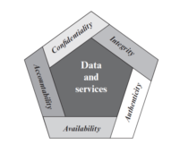
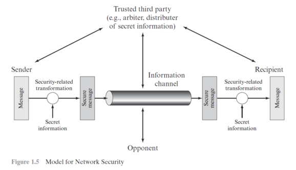

-   计算机安全：对于一个自动化的信息系统，采取保护措施确保信息系统资源（包括硬件、软件、固件、信息/数据和通信）的完整性、可用性和保密性
    -    CIA三元组
        -   保密性：数据保密性、隐私性
        -   完整性：数据完整性、系统完整性
        -   可用性
    -   真实性
    -   可追溯性
-   Essential Network and Computer Security Requirements 
-   OSI安全架构（X.800）
    -   安全攻击：任何危及信息系统安全的行为
    -   安全机制：用来检测、组织攻击或从攻击状态恢复到正常状态的过程（或实现该过程的设备）
    -   安全服务：加强数据处理系统和信息传输安全性的一种处理过程或通信服务，目的在于利用一种或多种安全机制进行反攻击
-   RFC4949（互联网安全术语表）
    -   威胁：破坏安全的潜在可能，在环境、能力、行为或事件允许的情况下，它们会破坏安全，造成危害 利用的是**系统脆弱性**
    -   攻击：对系统安全的攻击，它来源于一种具有智能的威胁，即有意违反安全服务和侵犯系统安全策略的**智能行为**
-   安全攻击
    -   被动攻击：信息泄露、流量分析
        -   不涉及对数据的更改，因此难以察觉
        -   重在预防而非检测（加密）
    -   主动攻击
        -   伪装：某实体假装成其他实体
        -   重放：未经授权地将截获的信息再次发送
        -   消息修改：未经授权地修改合法消息的一部分，或延迟消息的传输
        -   拒绝服务：阻止或禁止对通信设施的正常使用或管理
-   安全服务
    
    -   在通信开放系统中，为系统或数据传输提供足够安全的协议层服务（X.800）
    -   一种由系统提供的对系统资源进行特殊保护的处理或通信服务；安全服务通过安全机制来实现安全策略（RFC4949）
    
    1.  认证：保证通信实体是它所声称的实体 同等（对等）实体认证、数据源认证
    2.  访问控制：阻止资源的非授权使用
    3.  数据保密性：保护数据免于非授权泄露 连接保密性、无连接保密性、选择域保密性、流量保密性
    4.  数据完整性：保证收到的数据的确是授权实体发出的数据 具有恢复功能的连接完整性、无恢复的连接完整性、选择域连接完整性、无连接完整性、选择域无连接完整性
    5.  不可否认性：防止整个或部分通信过程中，任一通信实体进行否认行为 源不可否认性、宿不可否认性
    6.  可用性服务：系统资源可以被授权实体请求访问或使用
-   安全机制
    -   Specific Security Mechanisms（特定安全机制） Encipherment(加密), digital signatures(数字签名), access controls(访问控制), data integrity(数据完整性), authentication exchange(认证交换), traffic padding(通信填充), routing control(路由控制), notarization(公证)
    -   Pervasive Security Mechanisms（普遍安全机制） trusted functionality(可信功能), security labels(安全标识), event detection(事件检测), security audit trails(安全审计追踪), security recovery(安全恢复)
-   安全服务与机制 
-   NCAE13安全设计准则
    -   Economy of mechanism 机制的经济性：嵌入在硬件和软件中的安全机制应设计得尽量简单
    -   Fail-safe defaults 故障安全默认：访问决策应基于允许而非拒绝——只有被允许的才允许访问
    -   Complete mediation 完整的检查：检查访问控制机制范围内的每一个访问——不能依赖于缓存
    -   Open design 开放的设计：安全机制的设计应该是开放的而不是保密的——只有密钥保密
    -   Separation of privilege 权限分离：需要多个权限属性来访问一个受限资源时的准则
    -   Least privilege 最小权限：系统的每个进程和用户应该以执行该任务所需的最小权限集进行操作
    -   Least common mechanism 最小共同机制：最小化不同用户共享的功能
    -   Psychological acceptability 心里接受度：安全机制在满足授权访问用户需求的同时，不应过度干涉用户工作
    -   Isolation 隔离：公共访问系统与关键资源隔离、各用户进程文件相互隔离、安全机制隔离
    -   Encapsulation 密封：面向对象的特定形式的隔离
    -   Modularity 模块化：安全功能作为单独模块开发，机制设计和实现的模块化
    -   Layering 分层：使用多个叠加的保护方法来保护信息系统的人员、技术和操作
    -   Least astonishment 最小意外：程序或用户接口应该让用户感到对意外事故的响应处理最小化
-   攻击面：由系统中一系列可访问且可利用的漏洞组成
    -   网络攻击面——网络协议的漏洞
    -   软件攻击面——应用程序、操作系统、Web服务器
    -   人类攻击面——系统人员或外部人员造成的漏洞
-   攻击树：采用分支化、层次化表示来利用安全漏洞的可能技术集合的数据结构 攻击目的：造成安全事件，是攻击树的根节点，子节点为子目标
-   网络安全模型 